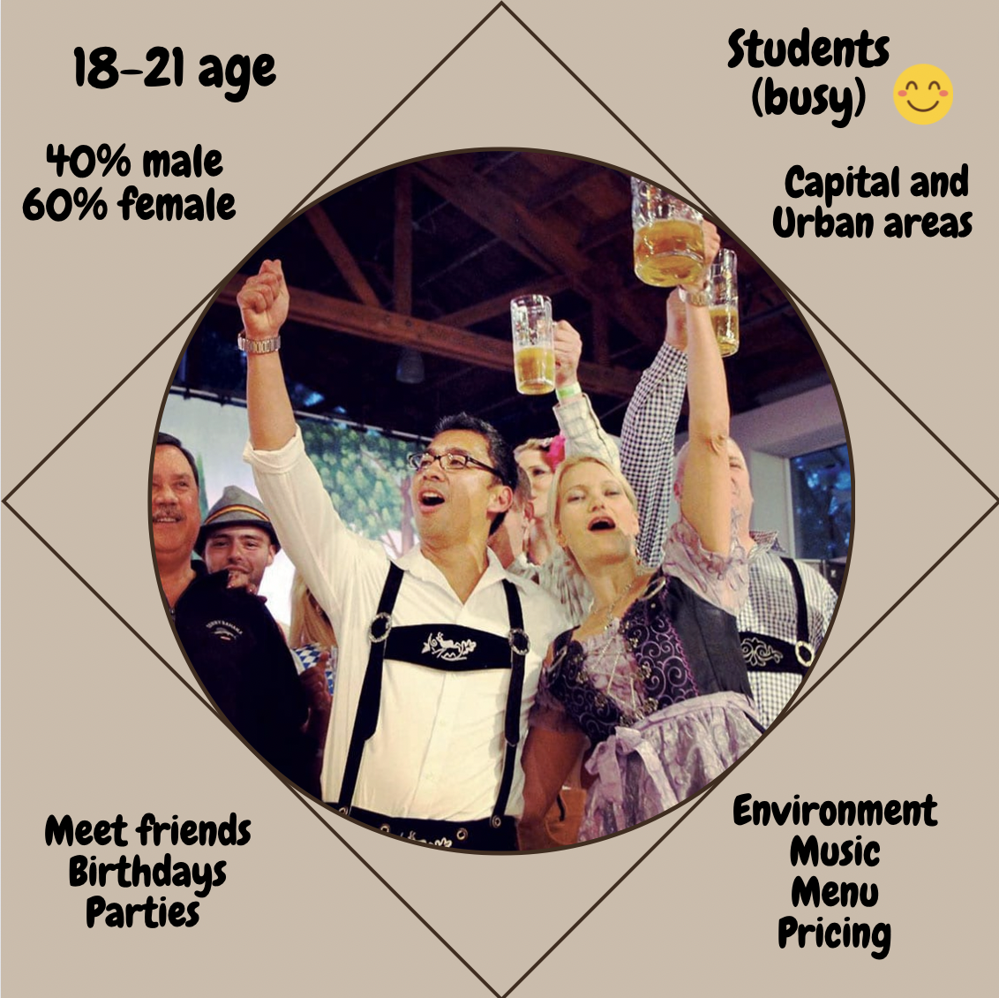

```{r setup, include=FALSE}
knitr::opts_chunk$set(echo = TRUE, warning = FALSE, message = FALSE)
```

## Import necessary libraries

```{r}
library(ggplot2)
library(GGally)
library(dplyr)
library(knitr)
library(ggthemes)
library(gridExtra)
library(ggExtra)
```

```{python}
import matplotlib.pyplot as plt
import pandas as pd
import numpy as np
```

## Data preprocessing

```{python}
data_pubs = pd.read_csv("pubs.csv")
data_pubs.info()
data_pubs.isna().sum().values.sum()
```

Let us define a theme which we will use to design our visualizations.

```{r}
theme_my <- theme(
    plot.title = element_text(face = "bold", size = 14),
    legend.background = element_rect(fill = "white", size = 4, colour = "white"),
    axis.ticks = element_line(colour = "grey70", size = 0.2),
    panel.grid.major = element_line(colour = "grey70", size = 0.1),
    panel.grid.minor = element_blank(),
    panel.background = element_rect(fill = "linen")
  )
```

```{python}
data_pubs.shape
```
As we can see we have 13 describing features for our 175 customers. Of course, 
our data is small one, but it can help us to grasp some information about 
Armenian pub customers.

# Analysis

## Profile of Pub Customer 

Let's analyze the survey data and characterize Armenian pub customers based on 
it.

Firstly, let us look at the range of customers.

## Age of customers

```{r, echo=FALSE}
data_pubs <- read.csv('pubs.csv')
```


```{r}
ggplot(data_pubs, aes(x = Age)) + geom_histogram(binwidth = 0.5,color ='brown') +
   labs(title = "Age of Armenian pub customers", x = "Age", y ="Count") +
   theme_my
```
Most of the customers are from age 18 to 21. 

## Gender of customers

```{r}
ggplot(data_pubs, aes(x = Gender)) + geom_bar(color = 'black', fill = "gray")+
   labs(title = "Gender of Armenian pub customers", x = "Gender", y ="Count") +
   theme_my
```
Number of Female customers is more than male customers.

## Occupation of customers

```{r}
# make 'working ' and 'working' same as whitespace doesn't change meaning
data_pubs$Occupation <- ifelse(data_pubs$Occupation == "Working ", "Working", 
                               data_pubs$Occupation)

ggplot(data_pubs, aes(y = Occupation)) + geom_bar(color = 'brown')+
   labs(title = "Occupation of Armenian pub customers", y = "Occupation", x ="Count") +
   theme_my
```
Most of the customers are students and students who are also working.

## How frequent customers who have different lifestyles visit pubs

```{r}
# keeping majority lifestyles and put other things into 'other'
majority_lifestyle <- c("Busy(student life, work)", "Nightlife", 
               "Adventure/traveling/exploring", "Sport", "Art")

# use ifelse to assign "other" to all values not in the list
data_pubs$Lifestyle <- ifelse(data_pubs$Lifestyle %in% majority_lifestyle, 
                              data_pubs$Lifestyle, "Other")

ggplot(data_pubs, aes(x = Lifestyle, fill = Freq)) + geom_bar(color = 'brown')+
   labs(title = "Lifestyle of pub customers filtered by frequency of visits", 
        x = "Lifestyle", y ="Count") + theme_my +
  theme(axis.text.x = element_text(angle = 80, hjust = 1)) +
   guides(fill=guide_legend("Frequency of visits"))
```
Majority of visitors have mentioned that they have busy lifestyle. Here again we
can see that most part of visitors are students or students who also work. Most 
of them rarely visit pubs once a month or several times in a month.

## Stratum of customers filtered by Occasions

```{r}
# keeping majority occasions and put other things into 'other'
majority_occasions <- c("Hang outs with friends", "Special events/parties", 
                    "Birthdays", "For listening good music")

# use ifelse to assign "other" to all values not in the list
data_pubs$Occasions <- ifelse(data_pubs$Occasions %in%majority_occasions, 
                              data_pubs$Occasions, "Other")

ggplot(data_pubs, aes(x = Stratum, fill = Occasions)) + 
  geom_bar(color = 'black') +
  labs(title = "Stratum of Armenian pub customers filtered by Occasions", 
  x = "Stratum", y ="Count") + theme_my
```
Most of the customers live in Capital or Urban areas. Majority reasons why 
customers visit pubs are birthdays, parties and to meet friends.

## Favorite pubs of Armenian customers

```{r}
top_pubs <- data_pubs %>%
  group_by(Fav_Pub) %>% filter(Fav_Pub != "I don't like pubs") %>%
  summarise(count = n()) %>%
  arrange(desc(count)) %>%
  top_n(5)

ggplot(top_pubs, aes(x = Fav_Pub, y = count)) +
  geom_bar(stat = "identity", fill = "steelblue") +
  labs(title = "Top 5 favorite pubs of Armenian customers",
       x = "Pub name",
       y = "Count") + theme_my
```

## What features customers like the most in pubs

Here the column names 'Prim_Imp' and 'Sec_Imp' are not explained. So, I think 
either they represent the first and second most important pub features for 
Armenian pub visitors or maybe they are the impressions of customers.

```{r}
p1 <- ggplot(data_pubs, aes(x = Prim_Imp)) + geom_bar(color = 'brown')+
   labs(title = "The most important characteristic 
        for Armenian pub customers", 
        x = "Characteristic", y ="Count") + theme_my +
        theme(plot.title = element_text(size = 10))

p2 <- ggplot(data_pubs, aes(x = Sec_Imp)) + geom_bar(color = 'brown')+
   labs(title = "The second most important characteristic 
        for Armenian pub customers", 
        x = "Characteristic", y ="Count") + theme_my +
        theme(plot.title = element_text(size = 10))

grid.arrange(p1, p2, nrow = 1)
```

First most important characteristics of a pub for the customer is that it has a 
great environment.

Second most important characteristics for the customer is that the pub has a 
great music.

## Profile of Armenian pub customers

```{r echo=FALSE, out.width = "50%", fig.align = "center"}

```

## What pubs I can recommend ...

As I do not go to pubs often, I do not have ready names of pubs to suggest, but 
according Tripadvisor (*https://www.tripadvisor.com/Restaurants-g293932-zfg11776-Yerevan.html*) 
some of the best pubs for young and interesting people are
**Mr. Hookah Amiryan**, **Brew**, **Kong**, **Daboo**, the last one is also very recommended 
by my university friends who usually go there and enjoy their time.


## Now let's analyze incomes of customers and how much money they are ready to
## spend in pubs and see if it is reasonable

```{r}
ggplot(data_pubs, aes(x = WTS/1000, y = Income/1000)) +
  geom_point(aes(color = ifelse(WTS/1000 > Income/1000, 
        "WTS greater than Income", "WTS not_greater than Income"))) +
  labs(title = "Income of customers vs Willingness to Spend (WTS) in pubs",
       x = "Willingness to Spend in thousands",
       y = "Income in thousands",
       color = "Income vs WTS") + theme_my + ylim(0, 1000) +
  scale_color_manual(values = c("WTS greater than Income" = "red", 
                                "WTS not_greater than Income" = "black"))
```

From the above graph we can see that mostly the customers have enough income
to spend as much money as they want to spend in pubs, however there are some cases
which are plotted with red color that are the customers who do not have enough 
income but they spend money in pubs, which is not reasonable.


